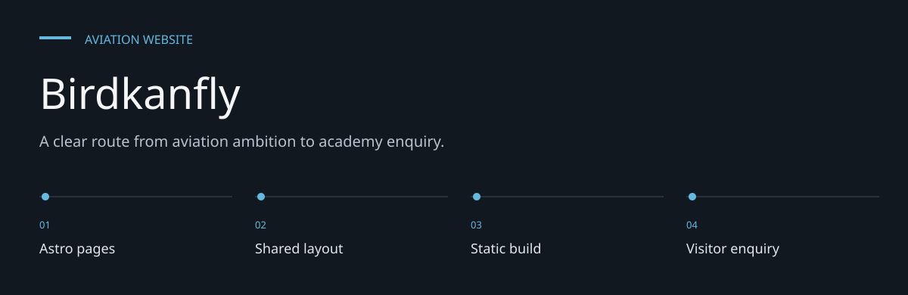
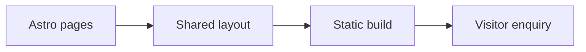

# Birdkanfly

**A clear route from aviation ambition to academy enquiry.**

A multi-page marketing website for a flight-training academy in Mysore.
It presents training programs, aircraft, admissions and contact information using Astro,
Tailwind CSS, Alpine.js and GSAP.


[Architecture](docs/ARCHITECTURE.md) · [Evaluation guide](docs/EVALUATION.md)

**Contents:** [The challenge](#the-challenge) · [Walkthrough](#walk-through-the-project) ·
[Implementation](#implementation-state) · [Design choices](#engineering-choices) ·
[Next evidence](#next-evidence-to-collect)

---

## The challenge

Prospective pilots need to understand training pathways, aircraft and admission requirements
before contacting an academy. The site organizes that information into dedicated pages, with
shared navigation and a consistent academy presentation.

## Browser preview


*Captured from the tracked website in Chromium on 7 October 2026. This is a local rendering, not a
claim about current public hosting.*

## System at a glance



## Walk through the project

### 1. Explore the academy

Start on the landing page and follow the academy, program and fleet links. The page content is
authored in Astro source.

### 2. Compare pathways

Open Programs and Admissions to inspect the course and application copy. Validate dates and
requirements with the academy before publication.

### 3. Inspect the fleet

Use the fleet page as a presentation of supplied content, not an independent airworthiness or
availability record.

### 4. Make an enquiry

Review the contact page and its form behavior. A rendered enquiry form is separate from proof that
a message reaches an operational inbox.

## Site map

| Route | Purpose |
| --- | --- |
| `/` | Academy introduction and program highlights |
| `/about` | Academy background |
| `/programs` | Training offerings |
| `/fleet` | Aircraft presentation |
| `/admissions` | Admissions information |
| `/contact` | Contact details and enquiry UI |

Pages are authored in [src/pages](src/pages); shared navigation and footer live in
[src/components](src/components). [Layout.astro](src/layouts/Layout.astro) wraps the pages.

## Local development

```bash
git clone https://github.com/DanushArun/birdkanfly.git
cd birdkanfly
npm ci
npm run dev
```

Open `http://localhost:4321`.

```bash
npm run build
npm run preview
```

The production build is written to `dist`. Dependencies are recorded in the package lockfile.
The repository has no test script or committed application backend.

## Content and verification

Academy accreditation, flying-day counts, course details and contact information are site copy.
This repository review does not independently verify those business claims.
Check them with the academy before publishing changes.

README links and package scripts were reviewed. No admissions submission, browser acceptance
suite or live hosting check was performed for this documentation update.

## Engineering choices

**Pages rather than one long form.** Training, aircraft and admissions have distinct reading tasks.

**Shared shell.** The layout/header/footer provide consistency across routes.

**Business claims remain attributable.** The source contains marketing statements; documentation
does not certify them.

## Implementation state

| State | Current evidence |
| --- | --- |
| Present | Six authored pages and shared header/footer |
| Present | Responsive styles and animation dependencies |
| Needs verification | Business claims, course dates and contact details |
| Not verified | Enquiry delivery and live hosting |

The [architecture guide](docs/ARCHITECTURE.md) maps these statements to source entry points.
The [evaluation guide](docs/EVALUATION.md) separates inspection, executable checks and
domain validation, with the next evidence needed for each project.

## Next evidence to collect

- Validate academy copy and accreditation references.
- Test every navigation and contact action.
- Record a production build and mobile acceptance run.

## Recorded checks — 7 October 2026

| Check | Observation |
| --- | --- |
| Production build | Passed; six routes generated |
| Browser preview | Loaded without page errors; screenshot captured |

Commands used:

```text
npm run build
Chromium at 1440 × 1000
```

These results cover the listed software paths. They do not establish live deployment,
external-service compatibility, accessibility conformance or domain efficacy.
